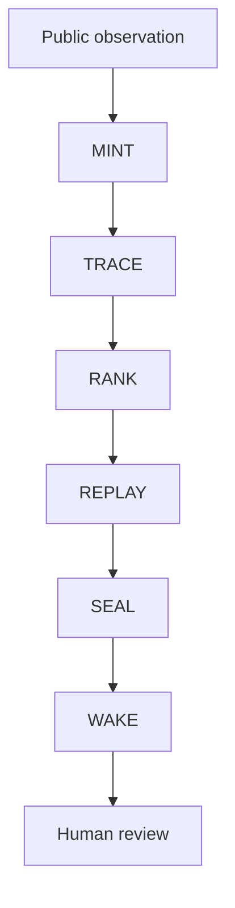

# Architecture

MORCHEL uses a one-way, inspectable handoff between six narrow roots.

## The six roots

1. **MINT** normalizes supplied public observations into `EvidenceCard`.
2. **TRACE** tries to reproduce explicit wallet relationships.
3. **RANK** returns only `ARCHIVE`, `WATCH`, or `WAKE_HUMAN`.
4. **REPLAY** compares the card with explicitly supplied archive matches.
5. **SEAL** records which declared sources can still be recovered.
6. **WAKE** may interrupt a human only when RANK passes and SEAL is reproducible.

Every handoff is a fixed JSON-serializable dataclass. Every root exposes an empty
`executable_actions` tuple. None can access a wallet, sign, trade, or move funds.

## Failure-closed rule

`WAKE_HUMAN` from RANK is not sufficient. A missing source forces WAKE to return `HOLD`,
even when the attention score is high. See [CASE 001](case-001.md).

## Non-goals

- price forecasting or PNL optimization;
- token recommendations;
- order execution or wallet automation;
- autonomous financial decisions.
